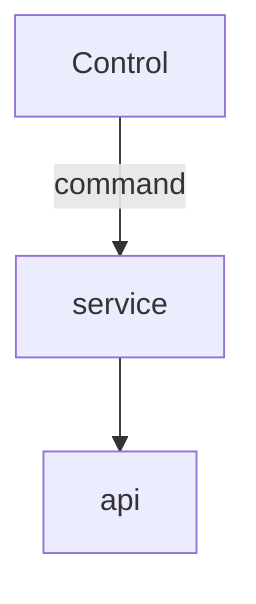

# Unified Design

## Components

### Controls

These are the UI components that can show information or do actions.

| Control   | Action         | Show               | Notes               |
|-----------|----------------|--------------------|---------------------|
| Slider    | Update a value | Show current value | eg. volume control  |
| Button    | Send a command | N/A                | eg. macro command   |
| Indicator | N/A            | Show current value | eg. cpu utilization |

 - For each control type, there can be a user input (action) and an info output.
 - Some controls have only one, some have both.

### Actions

These are the actions that a user can execute via various controls

| Action       | Data       | Response  | Notes              |
|--------------|------------|-----------|--------------------|
| Update value | key, value | N/A       | eg. volume control |
| Toggle       | key        | new state | eg. mute           |
| Do action    | key        | ?         | eg. macro command  |

 - For each action, at least a `key` is required to identify the action.
 - Some actions require a value or multiple values
 - Some actions will result in a response, that updates state (eg. mute)

### Info

These are messages pulled from the server and displayed to the user via controls

| Info  | Data       | Notes |
|-------|------------|-------|
| value | key, value |       |

 - For each value, a key represents what the value is
 - Some info sets can have more than 1 value
 - Some info is static, some is dynamic and needs to be retrieved periodically

## Requirements

 - Client should be able to retrieve all info in one request, and distribute it to the right controls to display it. This is for efficiency and performance.
 - The same information should be possible to display in different controls, so long as their type matches
 - Client should be able to invoke actions individually - to make sure it is executed with no latency.
 - The same action should be possible to invoke from different controls, so long as their type matches

## Mapping

### Actions

| Capability | Key      | type   | name (sub-key)   | Args           |
|------------|----------|--------|------------------|----------------|
| Commands   | `cmd`    | do     | `<command name>` | ?              |
| Macro      | `macro`  | do     | `<macro name>`   | ?              |
| Volume     | `volume` | set    | `set-volume`     | `[app, value]` |
| Volume     | `volume` | toggle | `toggle-mute`    | `[app]`        |

### Info

| Capability | Key       | name (sub-key) | Args                 |
|------------|-----------|----------------|----------------------|
| Volume     | `volume`  | `volume`       | `[app, value]`       |
| Volume     | `volume`  | `mute`         | `[app, muted-state]` |
| Monitoring | `monitor` | `<value name>` | `[value]`            |

## Type design

```ts

// Action
var action = { key: { name: 'subkey', args: {} } };

// Info
var info = { key: { name: 'subkey', args: {} } };

```

## Flow


